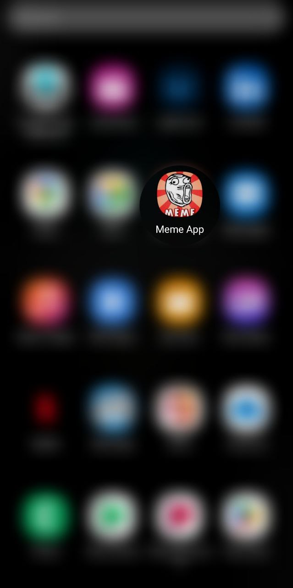
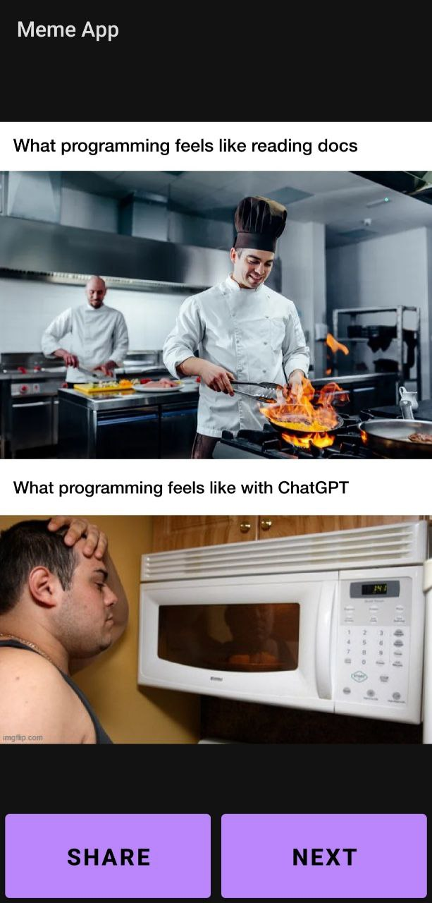
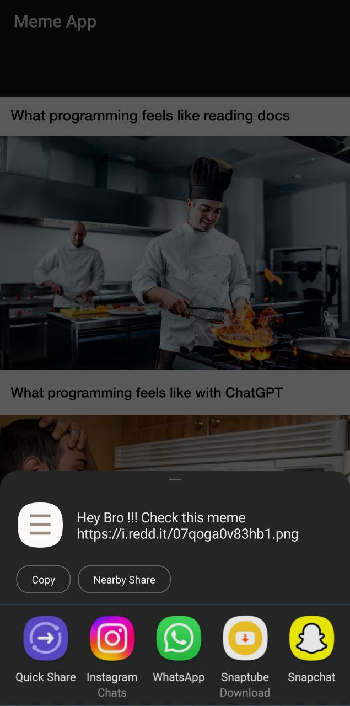

<h1>Meme Share App</h1>

<h4>The Meme Share App is an Android application developed in Android Studio that allows users to browse and share memes sourced from Reddit. 
  The app integrates with the Reddit API to fetch and display memes, providing users with a simple and enjoyable way to discover and share humorous content.
</h4>

<h3>Features</h3>
<li>Fetches memes from Reddit using the Reddit API.</li>
<li>Displays memes in a user-friendly interface, one at a time.</li>
<li>Provides users with the ability to easily share memes with friends and on social media platforms.</li>
<li>Allows users to navigate to the next meme when desired.</li>
<li>Offers a seamless and engaging experience for meme enthusiasts.</li>

<h3>Screenshots</h3>

<h3>Usage</h3>

<li>Upon launching the app, users will be presented with a random meme fetched from Reddit.</li>
<li>To view the next meme, simply tap the "Next" button.</li>
<li>If a meme catches your eye and you want to share it, tap the "Share" button to bring up sharing options.</li>

<h3>Contributions</h3>
<h4>Contributions to the Meme Share App are welcome! If you'd like to contribute:</h4>

<li>Fork the repository.</li>
<li>Create a new branch for your feature or bug fix.</li>
<li>Make your changes and commit them with descriptive commit messages.</li>
<li>Push your changes to your forked repository.</li>
<li>Create a pull request detailing your changes and their purpose.</li>

<h3>Contact</h3>
If you have any questions, suggestions, or feedback, feel free to contact the project owner Mayank Runija via mickeyruni18@gmail.com.

Enjoy sharing and exploring hilarious memes with the Meme Share App! Your feedback and contributions are highly appreciated.

